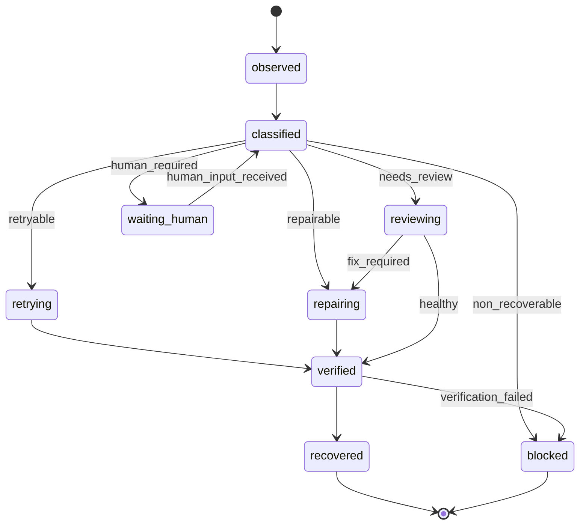

# Recovery Engine 重设计合同

更新时间：2026-05-20

## 1. 背景判断

当前 `watchdog` 不能作为 Recovery Engine 的直接底座。

原因：

- 它在控制面配置中实际是一个开关，默认关闭。
- 过去实践中看护输出质量不稳定，容易给出低价值判断或错误修复方向。
- 它主要围绕“任务异常后再触发一次 LLM 看护”组织，而不是围绕可验证状态机、恢复策略和确定性动作组织。
- 它把 review、remediation、队列暂停、重新发布、状态修正等职责混在一起，边界过宽。

因此后续不能沿着 `watchdog-runtime.js` 继续补丁式扩展。正确路线是重新设计 Recovery Engine，保留现有 watchdog 代码作为历史能力和少量证据来源，而不是作为平台级恢复核心。

## 2. Recovery Engine 目标

Recovery Engine 负责让纯 AI 项目组在多数异常下自行推进，而不是等待人工连续介入。

它必须回答：

- 当前异常属于哪一类？
- 谁拥有恢复状态？
- 哪个事件触发恢复？
- 可以执行哪些确定性动作？
- 什么时候允许调用 LLM 判断？
- 什么时候必须停止并请求人工？
- 恢复结果如何进入中台、任务状态和后续调度？

## 3. 状态分类

恢复分类必须先于动作存在。

| 分类 | 含义 | 默认动作 |
| --- | --- | --- |
| `retryable` | 临时失败，重试可能成功 | 自动重试，限制次数和退避 |
| `repairable` | 可通过代码、配置、状态或发布修复 | 创建修复任务或执行受限修复动作 |
| `needs_review` | 需要独立 reviewer 判断风险或质量 | 进入 reviewer，不直接修改 |
| `human_required` | 外部账号、密钥、授权、业务决策或发布窗口 | 明确请求人工，并给出最小上下文 |
| `non_recoverable` | 当前系统无法安全恢复 | 阻塞并写入风险报告 |

## 4. 状态机

## 5. 设计约束

- 结构化事件是恢复真值；自然语言日志只能解释，不得驱动状态迁移。
- 每次恢复必须有 `trigger_event_id`、`classification`、`action_plan`、`attempts`、`verification`、`result`。
- LLM 只能在分类、摘要、修复建议和 reviewer 判断中使用；具体重试、发布、检查、状态迁移要由确定性代码执行。
- Recovery Engine 不能绕过 CI/CD、workflow closeout、live verification 或人工授权边界。
- 不允许“看护说可以继续”直接改变任务成功状态；必须有可检查证据。
- 中台必须把“系统正在自愈”和“等待人工决策”分开展示。

## 6. Watchdog 迁移策略

现有 watchdog 后续只保留三类价值：

1. 历史异常样本：用于抽取恢复分类和失败模式。
2. 临时观察器：在 Recovery Engine 未完成前仍可作为可选告警来源。
3. 反例库：记录哪些 LLM 看护输出不能直接信任。

不得继续新增大块恢复职责到 watchdog 内部。新增恢复能力必须进入独立 `recovery-domain` / `recovery-runtime` / `recovery-store` 设计。

## 7. 最小落地顺序

1. 定义 `recovery_events`、`recovery_attempts`、`recovery_actions` 的数据结构。
2. 把现有 stale running、publish drift、verification gate failure、blocked without reason 映射到分类。
3. 为每类只实现一个确定性恢复动作，并加验证。
4. 中台增加 Recovery 队列视图：触发原因、分类、动作、尝试次数、结果、是否需要人工。
5. 再决定是否接入 LLM reviewer 或 remediation agent。
